# Building Instructions (Version 1)

The Cognifly is a drone with easy manufacturing, allowing
customization and autonomous flight. It has an optical flow and lidar,
allowing position and altitude hold, and a Raspberry Pi Zero 2W, allowing
wireless control and data processing. The
flight controller is working with INAV, which allows an easy
configuration of the drone.

This version of the cognifly features an intel realsense T265 camera for stabilization in challenging environments and the proper battery to support the additional weight. It can also use a crazyfly multiranger deck for onboard obstacle detection. 


The frame is built with wood sticks and resists to impact while flying.
Another configuration is possible with carbon fiber. It is highly recommended, as the frame can resist to more violent impacts (which can occur due to the increased weight of this version of the Cognifly). However, it is more
expensive and heavier. 


The carbon fiber version of CogniFly weighs 370g. It uses a LiPo battery 4S (14.8V, 130C) with a
1800mAh capacity, leading to a 10-minute flight time.

**Note** that the [Latest](../Latest/readme.md) version of the cognifly can be adapted to support the T265, by swapping the base mounts.

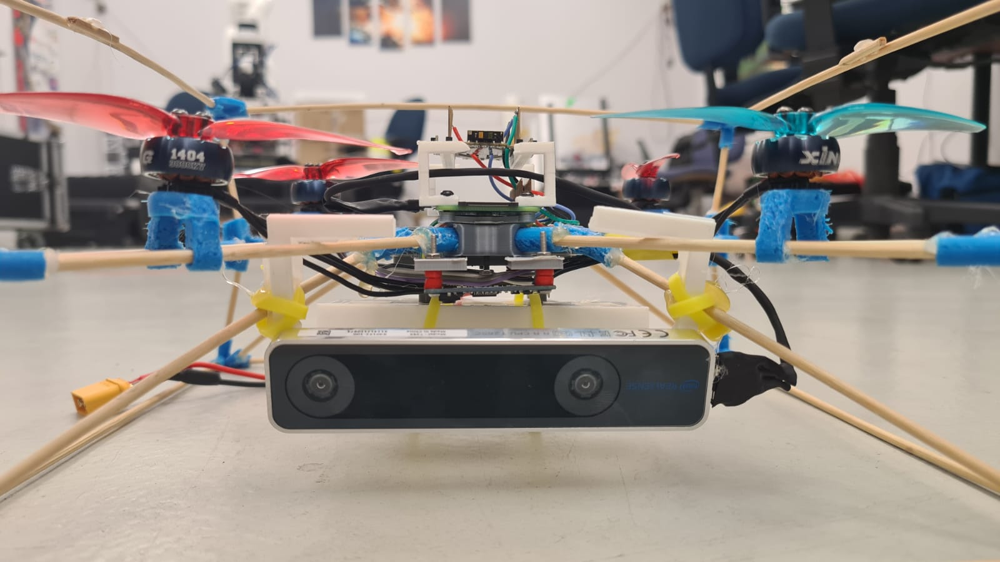

## Table of Contents
1. [Bill of Materials](readme.md#bill-of-materials)
    * [Table 1: Description of the hardware for one drone](readme.md#table-1-description-of-the-hardware-for-one-drone)
    * [Table 2: Bill of Materials using a Raspberry Pi zero 2W](readme.md#table-2-bill-of-materials-using-a-raspberry-pi-zero)
2. [Building the drone](readme.md#building-the-drone)
    * [Frame](readme.md#frame)
    * [Electronics](readme.md#electronics)
    * [Putting everything together](readme.md#putting-everything-together)
3. [Software setup](readme.md#software-setup)
    * [INAV](readme.md#inav)
    * [Raspberry Pi Zero 2W](readme.md#raspberry-pi-zero-w)
4. [Troubleshooting](readme.md#troubleshooting)
    * [Wifi not working](readme.md#wifi-not-working)
    * [ssh not available](readme.md#ssh-not-available)
    * [Flashing the FC](readme.md#flashing-the-fc)
    * [Motors overheating](readme.md#some-motors-overheat)
5. [Acknowledgements](readme.md#acknowledgements)

## Bill of Materials

To build this drone, some tools will be needed and not included in the
following list: a 3D printer (ideally two so you can print continuously
the TPU parts and the PLA parts for more than 1 drone), a soldering iron
with tin (and flux), a hot glue gun with glue, super glue, and a screwdriver for M2 & M3
screws, wire strippers, pliers…

### *Table 1: Description of the hardware for one drone*

<table>
<thead>
<tr class="header">
<th>Part Number</th>
<th>Item</th>
<th>Description</th>
<th>Quantity</th>
</tr>
</thead>
<tbody>
<tr class="odd">
<td>CF01-CF04</td>
<td><p>Wood stick</p>
<p><em>Or carbon fibre rods</em></p></td>
<td><p>Frame</p>
<p>Diameter: 3mm; Length : &gt;25cm</p></td>
<td>20 sticks</td>
</tr>
<tr class="even">
<td>CF05-CF10</td>
<td>TPU95a filament</td>
<td><p>Frame (Joints)</p>
<p>TPU95a filament; flexible plastic parts</p></td>
<td>34g</td>
</tr>
<tr class="odd">
<td>CF11-CF17</td>
<td>PLA filament</td>
<td><p>Structure</p>
<p>PLA filament; Hard plastic parts</p></td>
<td>24g</td>
</tr>
<tr class="even">
<td><p>CF18A</p>
<p>CF18B</p></td>
<td>Motor XING2 1404 3000KV</td>
<td><p>Motor XING2 1404<br />
3000KV; 10,1g</p>
<p>(7mm screws included used for propellers, Raspberry Pi, and optical flow attachment)</p></td>
<td><p>4</p>
<p>(18)</p></td>
</tr>
<tr class="odd">
<td>CF19</td>
<td>Screw spacer</td>
<td>M2 Rubber Damping Ball (for the optical flow)</td>
<td>2</td>
</tr>
<tr class="even">
<td><p>CF20A</p>
<p>CF20B</p></td>
<td>FC – ESC JHEMCU GHF420 35A</td>
<td><p>20x20mm Jhemcu GHF420AIO F4 OSD Flight Controller w/ 5V 9V BEC Output &amp; Built-in 35A BL_S 4In1 Brushless ESC</p>
<p>(4 Rubber Damping Balls included used for FC attachment and connector to make power cables)</p></td>
<td><p>1</p>
<p>(4)</p></td>
</tr>
<tr class="odd">
<td>CF21-CF22</td>
<td>Propellers 4024</td>
<td>Gemfan Hurricane 4024 2 Blades</td>
<td>2CW and 2CCW</td>
</tr>
<tr class="even">
<td>CF23</td>
<td>Matek Optical Flow and Lidar</td>
<td>Matek Optical Flow &amp; Lidar Sensor - 3901-L0X</td>
<td>1</td>
</tr>
<tr class="odd">
<td>CF24</td>
<td>Raspberry Pi Zero 2W</td>
<td>Raspberry Pi Zero 2W (Wireless)</td>
<td>1</td>
</tr>
<tr class="even">
<td>CF25</td>
<td>SD card</td>
<td>Micro SD card &gt; 16Go</td>
<td>1</td>
</tr>
<tr class="odd">
<td>CF26</td>
<td>Lipo 4S 1800mAh</td>
<td>Sunpadow Lipo Battery Battery 4S; 1800 mAh; 7,4V 130C</td>
<td>1 or more</td>
</tr>
<tr class="even">
<td>CF27</td>
<td>M2 Screw 4mm</td>
<td>M2 Screw 4mm</td>
<td>16</td>
</tr>
<tr class="odd">
<td>CF28</td>
<td>M2 Screw 16mm</td>
<td>M2 Screw 16mm</td>
<td>6</td>
</tr>
<tr class="even">
<td>CF29</td>
<td>Wire 28/32 AWG</td>
<td>4 Wires 28/32 AWG (4 colors)</td>
<td>2X15cm</td>
</tr>

</tbody>
</table>


### *Table 2: Bill of Materials using a Raspberry Pi Zero 2W*

<table>
<thead>
<tr class="header">
<th>Item</th>
<th>Link Canada 2021</th>
<th>Quantity</th>
<th>Drone quantity</th>
<th>Price (CAD)</th>
<th>Price for one drone</th>
<th>Price for 5 drones</th>
<th>Price for 10 drones</th>
</tr>
</thead>
<tbody>
<tr class="odd">
<td>Wood stick</td>
<td><a href="https://www.amazon.ca/-/fr/Chef-Craft-brochettes-fines-bambou/dp/B075YFB1SZ/ref=sr_1_18?__mk_fr_CA=%C3%85M%C3%85%C5%BD%C3%95%C3%91&amp;dchild=1&amp;keywords=thin%2Bwood%2Bstick&amp;qid=1629398993&amp;sr=8-18&amp;th=1"><span class="underline">Amazon</span></a><br />
grocery store</td>
<td>1</td>
<td>6</td>
<td>8,67</td>
<td>8,67</td>
<td>8,67</td>
<td>17,34</td>
</tr>
<tr class="even">
<td>TPU95a filament</td>
<td><a href="https://www.amazon.ca/Polymaker-PolyFlex-Flexible-Filament-Dimensional/dp/B083XFT675/ref=sr_1_1_sspa?dchild=1&amp;keywords=TPU%2B95A&amp;qid=1626802130&amp;sr=8-1-spons&amp;spLa=ZW5jcnlwdGVkUXVhbGlmaWVyPUFCRDlKRDlaMEtROE8mZW5jcnlwdGVkSWQ9QTA3MjQ2MjYzREpFMDdVT1JISlhJJmVuY3J5cHRlZEFkSWQ9QTAzNDk1MjIxRDIzMEtGNEpENFdWJndpZGdldE5hbWU9c3BfYXRmJmFjdGlvbj1jbGlja1JlZGlyZWN0JmRvTm90TG9nQ2xpY2s9dHJ1ZQ&amp;th=1"><span class="underline">Amazon</span></a></td>
<td>1</td>
<td>15+</td>
<td>39,99</td>
<td>39,99</td>
<td>39,99</td>
<td>39,99</td>
</tr>
<tr class="odd">
<td>PLA filament</td>
<td><a href="https://www.amazon.ca/construction-pr%C3%A9cision-dimensionnelle-compatible-imprimantes/dp/B07PGZNM34/ref=sr_1_1_sspa?dchild=1&amp;keywords=PLA&amp;qid=1629404851&amp;sr=8-1-spons&amp;psc=1&amp;spLa=ZW5jcnlwdGVkUXVhbGlmaWVyPUFNTFRJVk4wRUtXRkMmZW5jcnlwdGVkSWQ9QTA4MjM2NTIyMzA5TUFQRk81S0kwJmVuY3J5cHRlZEFkSWQ9QTA3MDg2NDdZQTlCQkdRRFlKNDMmd2lkZ2V0TmFtZT1zcF9hdGYmYWN0aW9uPWNsaWNrUmVkaXJlY3QmZG9Ob3RMb2dDbGljaz10cnVl"><span class="underline">Amazon</span></a></td>
<td>1</td>
<td>15+</td>
<td>28,99</td>
<td>28,99</td>
<td>28,99</td>
<td>28,99</td>
</tr>
<tr class="even">
<td>Motor XING2 1404 3000KV</td>
<td><a href="https://shop.iflight-rc.com/motors-cat88/xing2-1404-toothpick-ultralight-build-unibell-pro1482"><span class="underline">Iflight</span></a><br />
<a href="https://www.banggood.com/IFlight-XING2-1404-3000KV-3800KV-4600KV-2-4S-Brushless-Motor-for-Toothpick-RC-Drone-FPV-Racing-p-1817793.html?cur_warehouse=CN&amp;ID=517763&amp;rmmds=search"><span class="underline">Banggood</span></a></td>
<td>4</td>
<td>1</td>
<td>20,50<br />
(26,95)</td>
<td>20,50</td>
<td>102,50</td>
<td>205,00</td>
</tr>
<tr class="odd">
<td>Screw spacer</td>
<td><p><a href="https://shop.iflight-rc.com/m2-m3-rubber-damping-ball-for-f4-f7-32k-flight-control-40pcs-pro294?search=rubber"><span class="underline">iflight</span></a></p>
<p><a href="https://www.banggood.com/20-PCS-SupraRC-M2x4-M2-Anti-vibration-Standoff-Rubber-Damping-Ball-for-F7BT-Flight-Controller-ESC-RC-Drone-FPV-Racing-p-1716028.html?cur_warehouse=CN&amp;rmmds=search"><span class="underline">Banggood</span></a></p></td>
<td>1</td>
<td>10<br />
5</td>
<td>8,96<br />
(10,26)</td>
<td>8,96</td>
<td>8,96</td>
<td>8,96</td>
</tr>
<tr class="even">
<td>FC – ESC JHEMCU GHF420 35A</td>
<td><p><a href="https://www.cyclonefpv.com/products/jhemcu-ghf420-aio-20x20-fc-20a-and-30a-options?variant=32949263695915"><span class="underline">cycloneFPV</span></a></p>
<p><a href="https://rotorvillage.ca/jhemcu-ghf420-f4-35a-aio-flight-controller/"><span class="underline">RotorVillage</span></a></p>
<p><a href="https://www.banggood.com/20x20mm-Jhemcu-GHF420AIO-F4-OSD-Flight-Controller-w-or-5V-9V-BEC-Output-and-Built-in-35A-BL_S-4In1-Brushless-ESC-Support-DJI-Air-Unit-for-RC-Drone-FPV-Racing-p-1742882.html?cur_warehouse=CN&amp;rmmds=search"><span class="underline">Banggood</span></a></p></td>
<td>1</td>
<td>1</td>
<td><p>76,92</p>
<p>(83,99)</p>
<p>(92,42)</p></td>
<td>76,92</td>
<td>384,6</td>
<td>769,20</td>
</tr>
<tr class="odd">
<td>Propellers 4024</td>
<td><p><a href="https://www.cyclonefpv.com/collections/4-props/products/gemfan-hurricane-4024-2-blade-1408-1506-motor-props?variant=31814821740587"><span class="underline">CycloneFPV</span></a></p>
<p><a href="https://rotorvillage.ca/gemfan-4024-hurricane-prop/"><span class="underline">RotorVillage</span></a></p>
<p><a href="https://www.banggood.com/4-Pairs-Gemfan-Hurricane-4024-2-blade-4-Inch-PC-Propeller-for-1408-1506-Brushless-Motor-RC-Drone-FPV-Racing-p-1657418.html?cur_warehouse=CN&amp;ID=3237&amp;rmmds=search"><span class="underline">Banggood</span></a></p></td>
<td>1</td>
<td>2</td>
<td><p>4,47</p>
<p>(5,49)</p>
<p>(10,26)</p></td>
<td>4,47</td>
<td>13,41</td>
<td>22,35</td>
</tr>
<tr class="even">
<td>Matek Optical Flow and Lidar</td>
<td><p><a href="https://www.getfpv.com/matek-optical-flow-lidar-sensor-3901-l0x.html"><span class="underline">GetFPV</span></a></p>
<p><a href="https://rotorvillage.ca/Matek-3901-L0X-Optical-Flow-Lidar-Sensor/"><span class="underline">RotorVillage</span></a></p>
<p><a href="https://www.amazon.ca/-/fr/Systems-3901-L0X-capteur-optique-quadrirotor/dp/B082LYQGDD/ref=sr_1_1?__mk_fr_CA=%C3%85M%C3%85%C5%BD%C3%95%C3%91&amp;dchild=1&amp;keywords=optical+flow+MATEK&amp;qid=1629401677&amp;sr=8-1"><span class="underline">Amazon</span></a><br />
<a href="https://can.grandado.com/products/style-matek-system-optical-flow-lidar-sensor-3901-l0x-module-support-inav-for-rc-drone-fpv-racing?gclid=CjwKCAjwgviIBhBkEiwA10D2j_rmPMCaVcrTGLS94mtNH6A3qJodS5BiQAEpW5reYIACUG_jistvVhoCVMUQAvD_BwE&amp;variant=UHJvZHVjdFZhcmlhbnQ6MTM4Mjc0Mzc2"><span class="underline">Grandado</span></a></p></td>
<td>1</td>
<td>1</td>
<td><p>38,46</p>
<p>(38,99)</p>
<p>(96,22)</p>
<p>(77,09)</p></td>
<td>38,46</td>
<td>192,30</td>
<td>384,60</td>
</tr>
<tr class="odd">
<td>Raspberry Pi Zero 2W</td>
<td><p><a href="https://www.cytron.io/p-raspberry-pi-zero-2-w"><span class="underline">Cytron</span></a></p>
<p><a href="https://www.pishop.co.za/store/raspberry-pi-zero-2-w"><span class="underline">Pishop</span></a></p>
</td>
<td>1</td>
<td>1</td>
<td><p>24.219</p>
<p>(22,29)</p></td>
<td>22,29</td>
<td>111,45</td>
<td>222,9</td>
</tr>
<td>1</td>
<td><p>10</p>
<p>5</p></td>
<td><p>11,99</p>
<p>(12,99)</p></td>
<td>11,99</td>
<td>11,99</td>
<td>11,99</td>
</tr>
<tr class="odd">
<td>SD card</td>
<td><p><a href="https://www.amazon.ca/Gigastone-cartes-surveillance-daction-professionnelle/dp/B07XB42B99/ref=sr_1_2_sspa?__mk_fr_CA=%C3%85M%C3%85%C5%BD%C3%95%C3%91&amp;dchild=1&amp;keywords=micro-sd+card+pack&amp;qid=1626973196&amp;sr=8-2-spons&amp;psc=1&amp;spLa=ZW5jcnlwdGVkUXVhbGlmaWVyPUExWktDN0ZITElYS0s2JmVuY3J5cHRlZElkPUEwNTM3NzEyTlAzNEs0Mkc4RVNKJmVuY3J5cHRlZEFkSWQ9QTAxMDQ4NjIxQjlRTTU2M0ZLOFlWJndpZGdldE5hbWU9c3BfYXRmJmFjdGlvbj1jbGlja1JlZGlyZWN0JmRvTm90TG9nQ2xpY2s9dHJ1ZQ=="><span class="underline">Amazon</span></a></p>
<p><a href="https://www.amazon.ca/-/fr/SanDisk-SDSQUAR-064G-GN6MA-m%C3%A9moire-microSDXC-adaptateur/dp/B073JYVKNX/ref=sr_1_5?__mk_fr_CA=%C3%85M%C3%85%C5%BD%C3%95%C3%91&amp;dchild=1&amp;keywords=micro+sd+card&amp;qid=1629471581&amp;sr=8-5"><span class="underline">Amazon</span></a></p></td>
<td><p>1</p>
<p>1</p></td>
<td><p>5</p>
<p>1</p></td>
<td><p>59,98</p>
<p>(15,39)</p></td>
<td>15,39</td>
<td>59,98</td>
<td>119,96</td>
</tr>
<tr class="even">
<td>Lipo 4S 1800mAh</td>
<td><a href="https://www.aliexpress.com/item/1005002303835558.html"><span class="underline">Aliexpress</span></a></td>
<td>2</td>
<td>1</td>
<td>18,01</td>
<td>36,02</td>
<td>180,1</td>
<td>360,2</td>
</tr>
<tr class="odd">
<td>M2 Screw 4mm</td>
<td><p><a href="https://www.cyclonefpv.com/products/m2-drone-screws-socket-head-cap-9-sizes-100-count-steel?variant=30883017818171"><span class="underline">CycloneFPV</span></a></p>
<p><a href="https://rotorvillage.ca/m2-x-5mm-black-steel-button-head-screw-8pk/"><span class="underline">RotorVillage</span></a><br />
<a href="https://www.amazon.ca/-/fr/XunLiu-molet%C3%A9es-hexagonale-alliage-dacier/dp/B07CHM7ZQK/ref=sr_1_38?__mk_fr_CA=%C3%85M%C3%85%C5%BD%C3%95%C3%91&amp;dchild=1&amp;keywords=m2+4+mm&amp;qid=1629404361&amp;sr=8-38"><span class="underline">Amazon</span></a></p></td>
<td><p>2</p>
<p>2</p>
<p>1</p></td>
<td><p>1</p>
<p>1</p>
<p>6</p></td>
<td><p>1,27</p>
<p>(2,49)</p>
<p>(46,06)</p></td>
<td>2,54</td>
<td>12,70</td>
<td>25,40</td>
</tr>
<tr class="even">
<td>M2 Screw 16mm</td>
<td><p><a href="https://www.cyclonefpv.com/products/m2-drone-screws-socket-head-cap-9-sizes-100-count-steel?variant=30883018014779"><span class="underline">CycloneFPV</span></a></p>
<p><a href="https://rotorvillage.ca/m2-x-16mm-black-steel-button-head-screw-8pk/"><span class="underline">RotorVillage</span></a></p>
<p><a href="https://www.amazon.ca/-/fr/XunLiu-molet%C3%A9es-hexagonale-alliage-dacier/dp/B07CHGZT5K/ref=sr_1_38?__mk_fr_CA=%C3%85M%C3%85%C5%BD%C3%95%C3%91&amp;dchild=1&amp;keywords=m2%2B4%2Bmm&amp;qid=1629404361&amp;sr=8-38&amp;th=1"><span class="underline">Amazon</span></a></p></td>
<td><p>1</p>
<p>1</p></td>
<td><p>1</p>
<p>16</p></td>
<td><p>1,27</p>
<p>(2,79)</p>
<p>(11,79)</p></td>
<td>1,27</td>
<td>6,35</td>
<td>12,70</td>
</tr>
<tr class="odd">
<td>Wire 28/32 AWG</td>
<td><a href="https://www.amazon.ca/1007-Bo%C3%AEte-solide-avec-%C3%A9lectriques/dp/B073RDGTPB/ref=sr_1_2_sspa?__mk_fr_CA=%C3%85M%C3%85%C5%BD%C3%95%C3%91&amp;dchild=1&amp;keywords=wire%2B32%2Bawg&amp;qid=1629405317&amp;sr=8-2-spons&amp;spLa=ZW5jcnlwdGVkUXVhbGlmaWVyPUFWTThFRTIyNUIzQzAmZW5jcnlwdGVkSWQ9QTEwNDY0MzQxMDBPUzdNVTAyQlU1JmVuY3J5cHRlZEFkSWQ9QTA4MzI0MjEyRFVDOU1SWjIwSkMyJndpZGdldE5hbWU9c3BfYXRmJmFjdGlvbj1jbGlja1JlZGlyZWN0JmRvTm90TG9nQ2xpY2s9dHJ1ZQ&amp;th=1"><span class="underline">Amazon</span></a></td>
<td>1</td>
<td>15+</td>
<td>19,88</td>
<td>19,88</td>
<td>19,88</td>
<td>19,88</td>
</tr>
<tr class="even">
<td>Electrical tape</td>
<td><a href="https://www.amazon.ca/-/fr/Temflex-TEMFLEX-3-4X60-adh%C3%A9sif-%C3%A9lectrique/dp/B003DXV9HY/ref=sr_1_7?__mk_fr_CA=%C3%85M%C3%85%C5%BD%C3%95%C3%91&amp;dchild=1&amp;keywords=electrical%2Btape&amp;qid=1629474319&amp;sr=8-7&amp;th=1"><span class="underline">Amazon</span></a></td>
<td>1</td>
<td>15+</td>
<td>1,24</td>
<td>1,24</td>
<td>1,24</td>
<td>1,24</td>
</tr>
<tr class="odd">
<td>Hot glue</td>
<td><a href="https://www.amazon.ca/-/fr/Adtech-W220-34ZIP30-b%C3%A2tons-colle-chaude/dp/B00009RUCS/ref=sr_1_6?__mk_fr_CA=%C3%85M%C3%85%C5%BD%C3%95%C3%91&amp;dchild=1&amp;keywords=Hot+glue&amp;qid=1629474469&amp;sr=8-6"><span class="underline">Amazon</span></a></td>
<td>1</td>
<td>15+</td>
<td>7,99</td>
<td>7,99</td>
<td>7,99</td>
<td>7,99</td>
</tr>
<tr class="even">
<td colspan="5">Total</td>
<td>407,9</td>
<td>1502,75</td>
<td>2881,99</td>
</tr>
<tr class="odd">
<td colspan="5">Unit total</td>
<td>407,9</td>
<td>300,55</td>
<td>288,199</td>
</tr>
</tbody>
</table>

The price does not include the shipping as each order must be shipped
separately. The price can be cheaper than shown on this document,
particularly for building a little number of drones, as you may already
have some component (for example the PLA filament) or if you find some
website shipping smaller quantities (for example connectors). It can also be more expensive due to the ongoing raspberry pi shortage. Two
batteries have been considered per drone to allow more flight
flexibility, but you may want to have more or less of those.

Be aware that some components can be difficult to find and may increase
a lot the price or the shipping time if not available on the first
website suggested on the tables (used to calculate the total price).
This is the case for the Raspberry Pi Zero 2W and the Matek Optical Flow.

While waiting for the longest shipping orders, you may want to print the
parts of the drones. 

## Notes on building

It is advised to test components of the Cognifly as you built it. For instance, as soon as you solder the optical flow to the FC, check on INAV that there are no hardware health issues. You can also test that the raspberry pi can connect to the FC, using the cognifly-controller script (just by connecting the FC to your computer) after having connected the rapsberry pi and the FC.


## Building the drone

### Frame

The frame is built with wood sticks, flexible plastics joints, and hard
plastic base. Wood stick can be replaced with carbon rods, leading to a
more resistant but heavier drone. Note that cutting carbon requires
precautions and longer manufacturing time.

**Step 1**

Print the joints with TPU95a filament setting the following
configuration:

  - 100% infill density

  - No printing supports

  - No build plate adhesion

  - 228°C printing temperature (verify with your TPU filament)

  - 35mm/s printing speed (verify with your TPU filament)


**Table 5: Joints made from TPU95a**

| Joint  | 3D part                        | Quantity | Joint  | 3D part                        | Quantity |
| ------ | ------------------------------ | -------- | ------ | ------------------------------ | -------- |
| TPU\_1 | 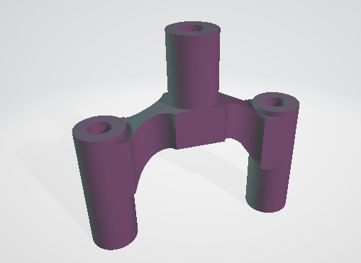 | 4        | TPU\_4 | 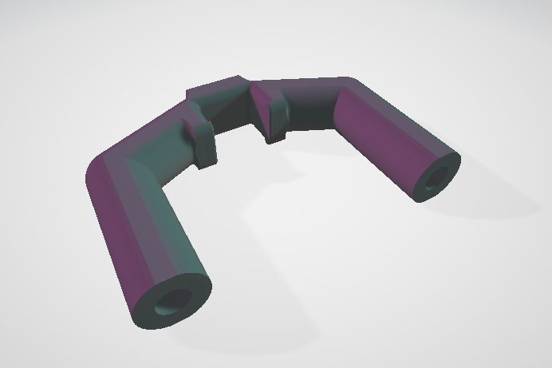 | 4        |
| TPU\_2 | 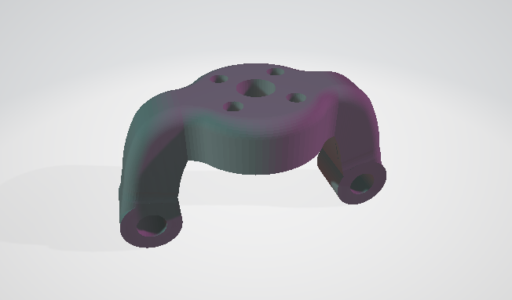 | 4        | TPU\_5 | 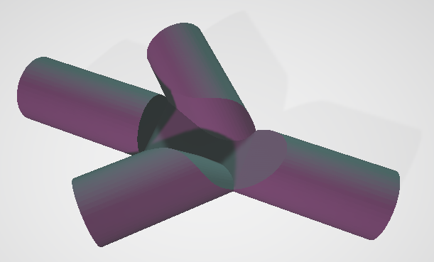 | 4        |
| TPU\_3 | 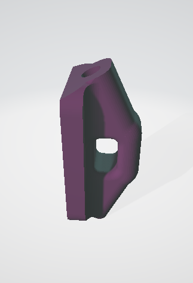 | 4        | TPU\_6 | 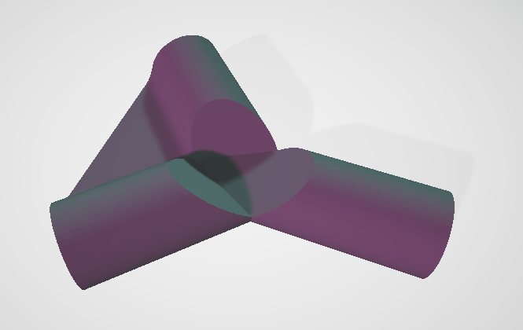 | 4        |

Make sure to orient each part as shown in the figure 1. The printing
time is 7h20 with the normal profile.

*Figure 1: Layout of TPU parts on Ultimaker 3.*

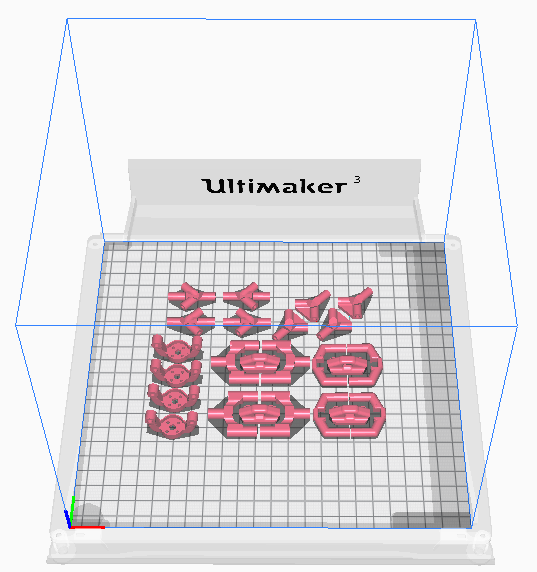

**Step 2**

Print the hard parts with PLA filament setting the following
configuration:

  - 10% infill density

  - No printing supports for PLA\_1, With printing supports for other
    parts

  - 200°C to 235°C printing temperature (verify with your PLA filament)

  - 60mm/s printing speed (verify with your PLA filament)

**Table 6: Joints made from PLA**

| Joint  | 3D part                         | Quantity            | Joint  | 3D part                         | Quantity |
| ------ | ------------------------------- | ------------------- | ------ | ------------------------------- | -------- |
| PLA\_1 |  | 1                   | PLA\_5 | 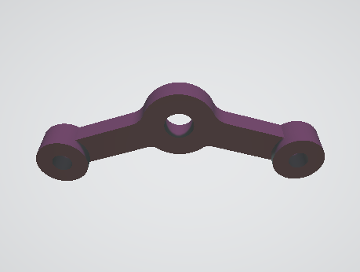 | 2        |
| PLA\_2 | 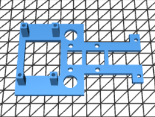 | 1                   | PLA\_6 | 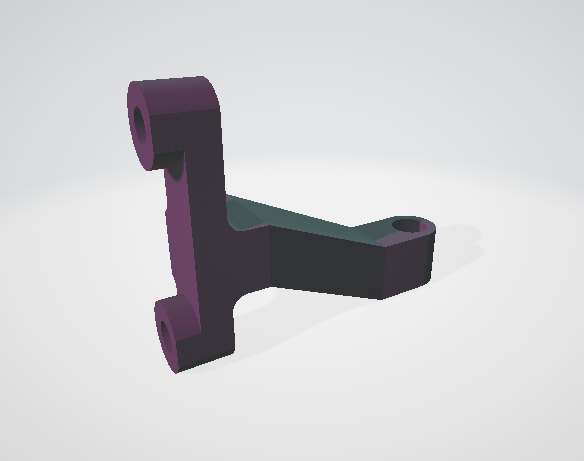 | 1        |
| PLA\_3 | 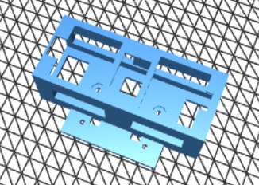 | 1                   | PLA\_7 |  | 1        |
| PLA\_4 | 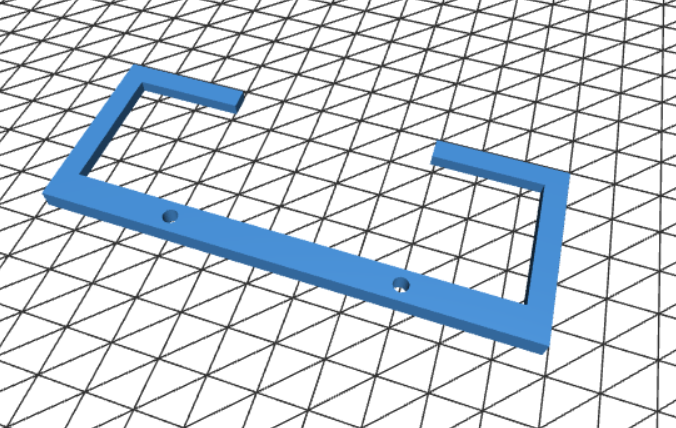 | 1                   | PLA\_8 | 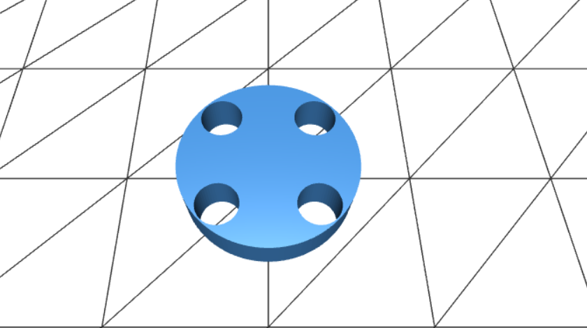 | 4        |
| PLA\_9 | 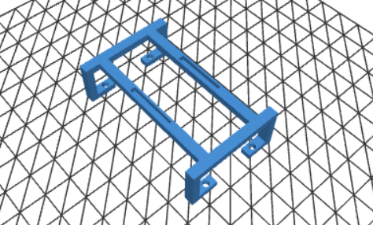 | 1 

Orientation of the parts in the printer are shown in figure 2. The
printing time is 1h35 for the PLA\_1 part (without printing supports)
and 4h10 for the other PLA parts (except the battery case). The printing time of the battery case is 4h16.

*Figure 2: Layout of PLA parts on Ultimaker 3*

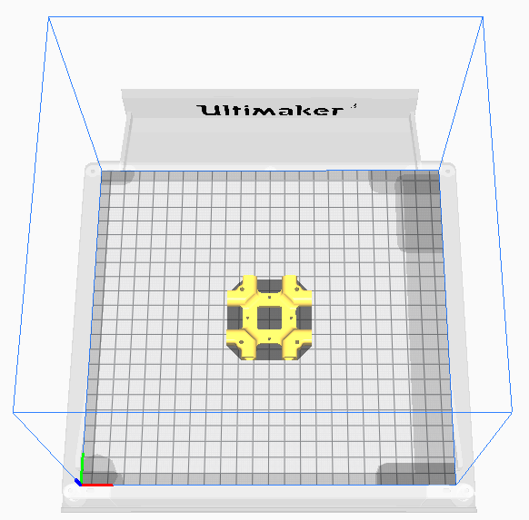 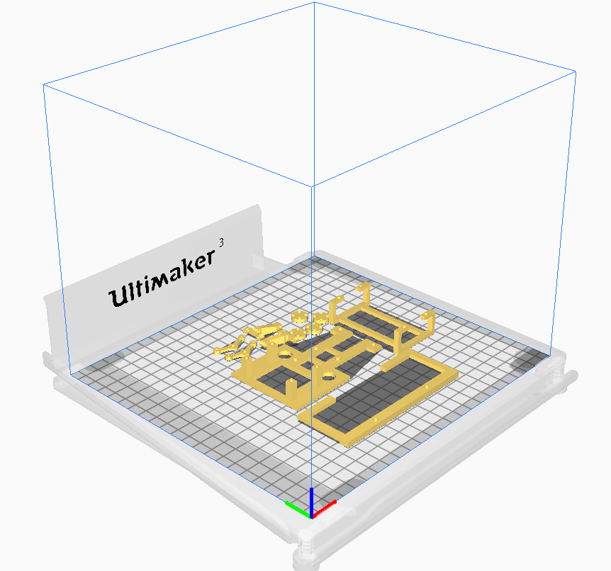 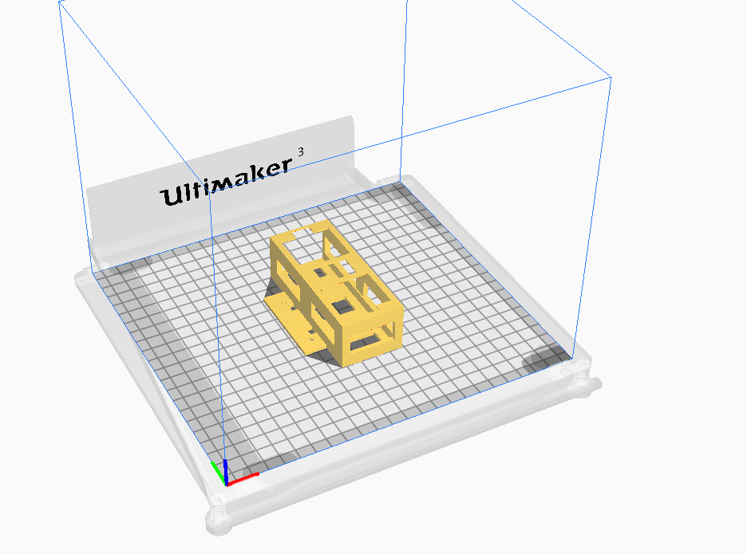

**Step 3**

Cut the sticks with a cutting pliers for wood frame of with a suitable
saw for carbon frame, to the dimensions written in table 6.

*Table 6: Stick dimensions and quantities for one drone*

| Dimension | Quantity |
| --------- | -------- |
| 23 cm     | 8        |
| 13 cm     | 4        |
| 11 cm     | 8        |
| 5 cm      | 8        |

**Step 4**

Insert the TPU\_4 part into the TPU\_3 central hole, you will need a
thin flat or round pliers. Reproduce the operations illustrated in the
figure 3.

*Figure 3: Insertion process of the joint (TPU\_4 into TPU\_3)*


Do this operation with the four groups of joint (for one drone).

**Step 5**

You have now all the component to build the frame. Figure 4 shows them
for the assembly of one drone.

*Figure 4: Frame components*


Now insert the sticks into the joints as follow. All steps are
illustrated with images.

1)  Insert the 11cm sticks into external hole of TPU\_1 joint.

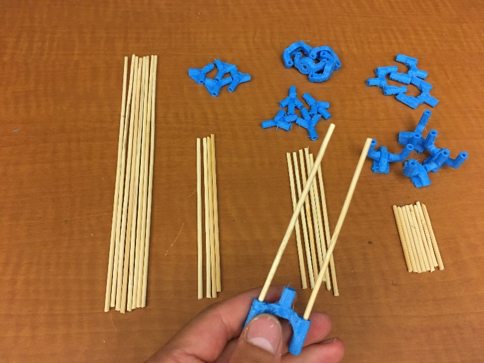

2)  Insert the 13cm sticks into the middle hole of TPU\_1 joint.

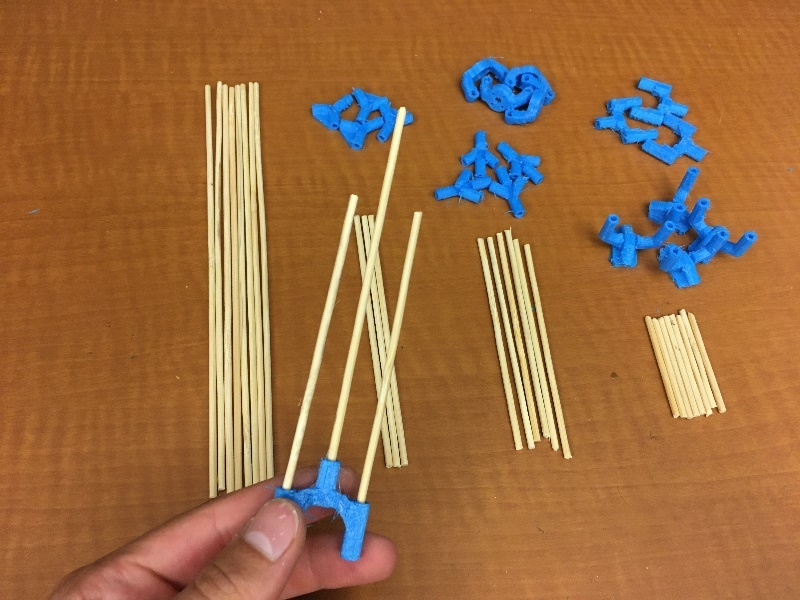

3)  Insert the TPU\_2 joint into the 11cm sticks from current assembly.


4)  Insert the TPU\_4 into the other ends of the 11cm sticks from
    current assembly.


5)  Insert the 5cm sticks into the holes of the TPU\_3 from current
    assembly.


6)  Insert the long foot of TPU\_5 into the 5cm stick as shown below.


7)  Insert the middle short foot of TPU\_5 into the 13cm stick.

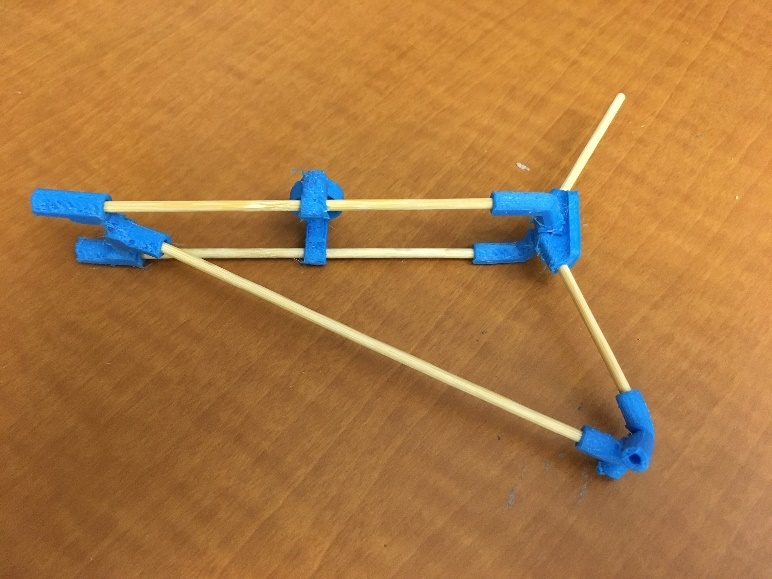

8)  Insert the TPU\_6 into the other 5cm stick from current assembly.


9)  Redo steps 1 to 8 three other times to get four assemblies.

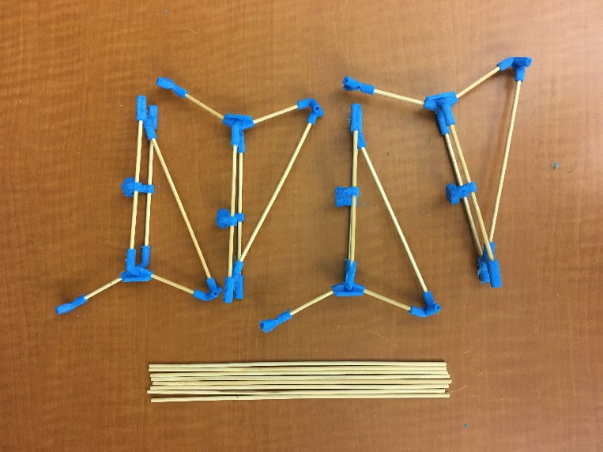

10) Insert the TPU\_1 of the first assembly into the sided holes of
    PLA\_1.


11) Redo step 10 with each assembly.

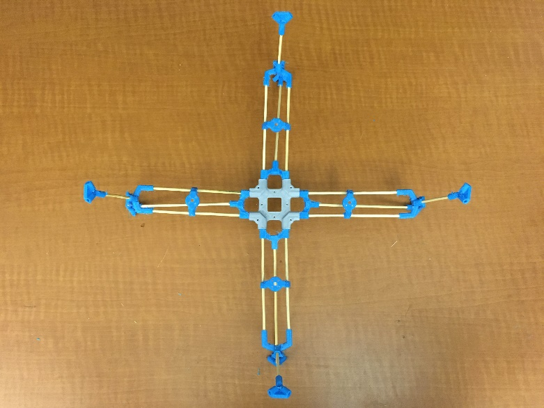

12) Insert a 23cm stick into the remaining holes of a TPU\_5 part.

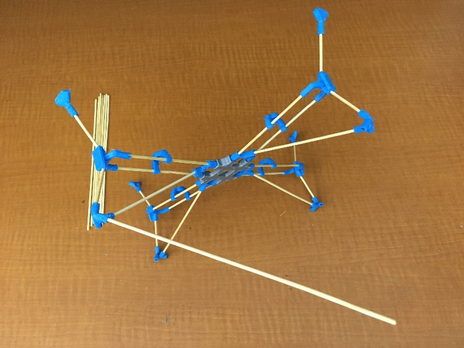

13) Redo step 12 for all TPU\_5 parts to complete the bottom of the
    frame.

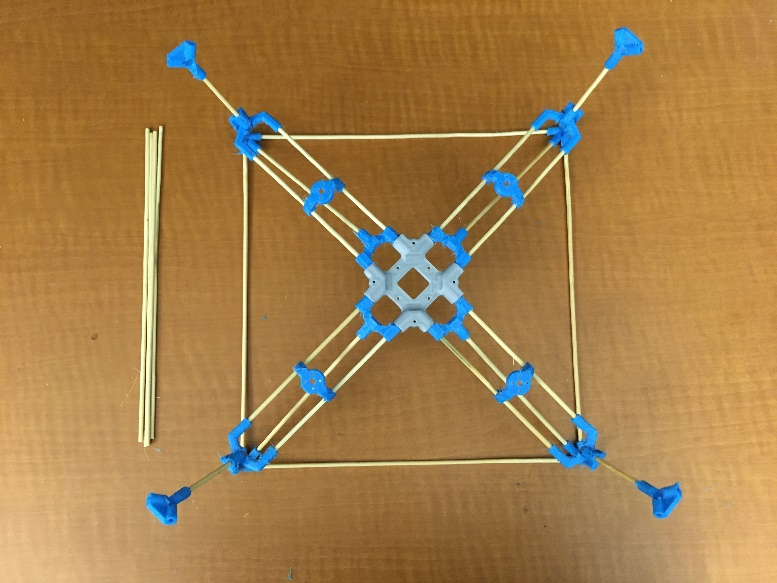

14) Insert the last 23cm sticks into TPU\_6 parts to complete the top of
    the frame.

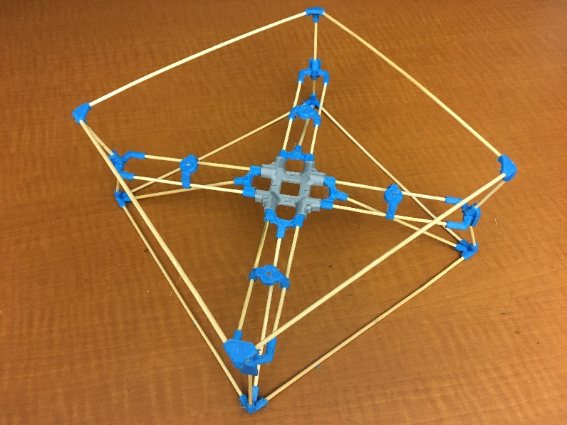

15) Glue the wood sticks to every TPU joints. Don’t glue the TPU\_1
    joints to the PLA\_1 part, it will allow to pass the wires and
    easier fix.

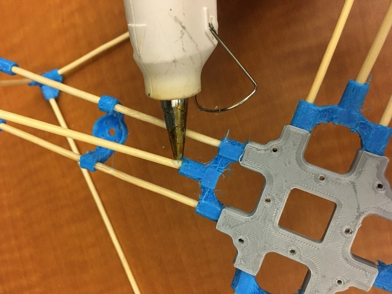

16) Thread the holes of the column in the PLA_2 part using a 3mm thread. Be gentle to avoid breaking the columns. 


### Electronics

The electronics of the drone need to be soldered into the flight
controller (FC) and the raspberri pi. The multiranger communicates with the raspberry pi via i2C.


**Step 6**
Take the raspberry pi, the multiranger support (PLA_9), the multiranger deck and headers.


1) Remove any leftover support from the PLA_9 part. 

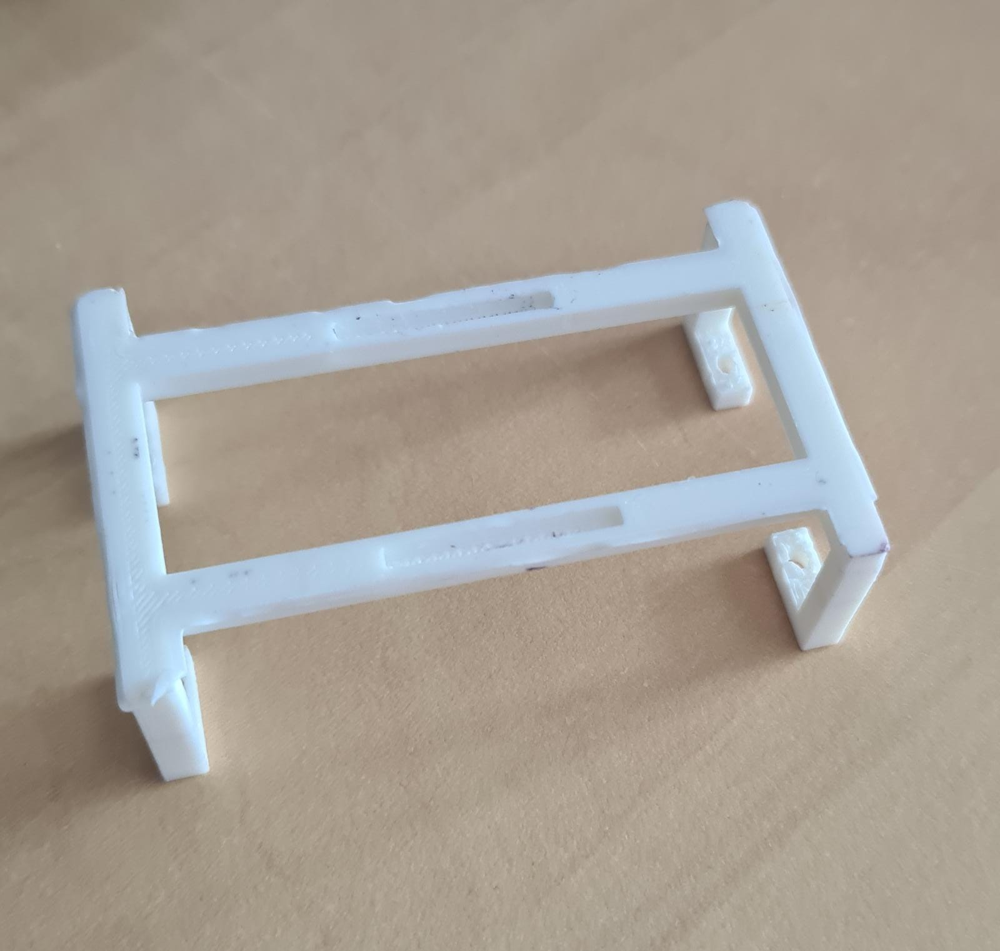


2) Press the headers into the two rectangular holes until they fit (not exceed the surface of PLA_9), then take them out. Put a bit of super glue inside the two rectangular holes, then the headers until the glue dries.

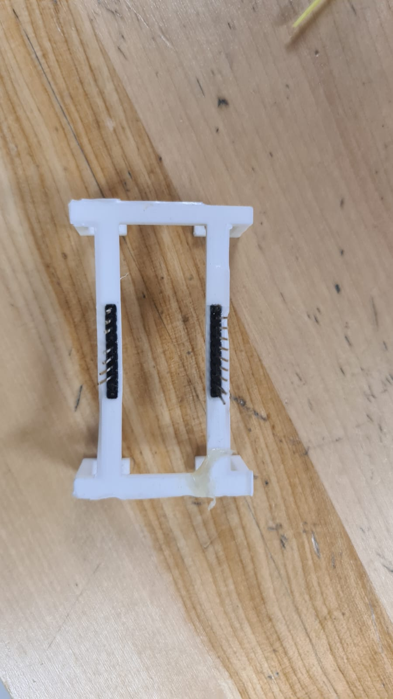

3) Insert the multiranger deck on the headers.

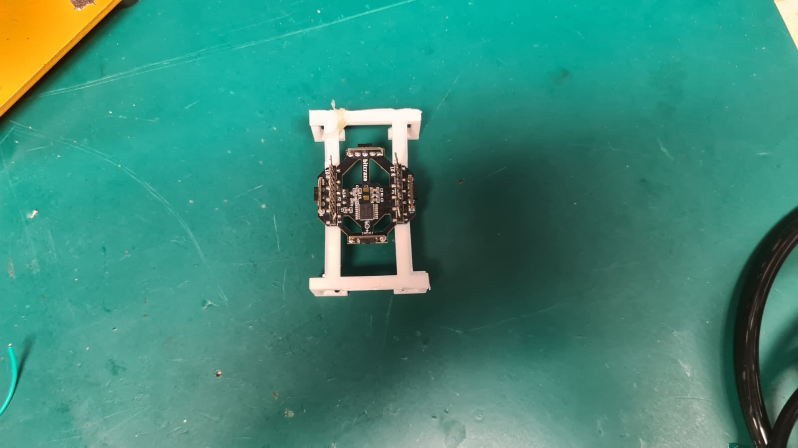

4) Take the AG28 wires and cut them in 4 pieces of 15 cm. Solder them to the SDA, SCL, Ground and VCOM pins (see the [Multiranger Deck Schematics](https://www.bitcraze.io/documentation/hardware/multi_ranger_deck/multi-ranger-reve.pdf)) from the top of the headers. Solder the SDA and SCL to the raspberry pi's SDA and SCL, respectively. Solder the ground to the raspberry pi's ground and the VCOM to the raspberry pi's 5V voltage input.

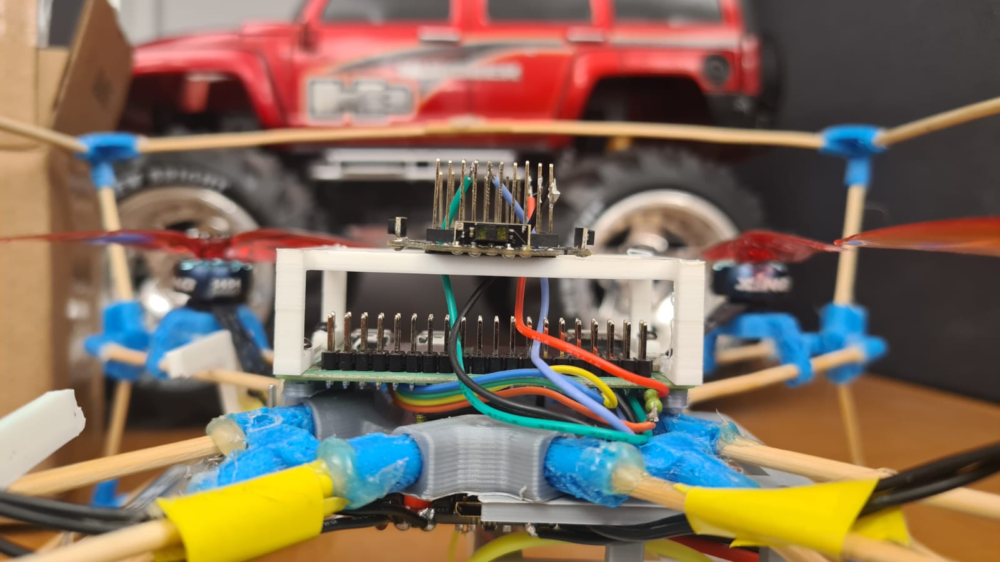


The Optical flow sensor and the Raspberry Pi Zero 2W use
the UART ports, and the motors are connected with three wires each into
the ESC (integrated to the flight controller board).

**Step 7**
The Optical flow sensor and the Raspberry Pi Zero 2W use
the UART ports, and the motors are connected with three wires each into
the ESC (integrated to the flight controller board).


Take the flight controller, the Raspberry Pi, the Optical Flow, and the four
motors.


Note that this guide's Step 7 is the same as Step 6 in the [Latest](../Latest/readme.md#electronics) version (more detailed).


Connect all the components to the flight controller as following.


1)  Take the AWG28 wires and cut them of approximately 15cm. Put some
    flux and tin on the following connectors of the FC: TX2; RX2; TX6;
    RX6; 4.5V; 5V; Ground (2) and all motors connectors.

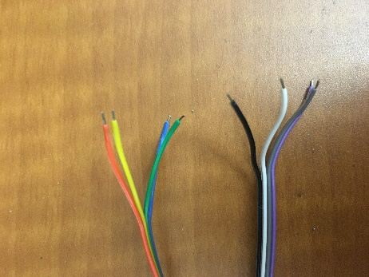 

2)  Solder the AWG28 wires on the connectors of the FC you prepared in
    previous step. Help you with the pictures.


The UART2 (TX2 and RX2) will be connected to the optical flow and UART6
(TX6 and RX6) will be connected to the Raspberry Pi. Before you decide
to change the ports, note that the Raspberry Pi has to be connected to
UART6 to work properly.

3)  Solder the motor wires onto the FC. Note that in the straight condition (propellers
    facing up and the arrow of the FC facing up, pointing forward), the
    wires of the motors are not crossing except for motor 3 (indicated
    on FC) which should have two wires inverted. This should guarantee
    the motors to spin in the good orientation. Help you with the
    following picture to follow the wires. 
    
    Therefore, each motor (except motor 3), facing upwards (see picture below) has their outwards wire connected to the outermost pads, the middle with the middle ones, and the inner ones with the inner ones.
    Motor 3's outermost wire goes to the middle pad, and the outermost pad is connected to motor 3's middle wire.


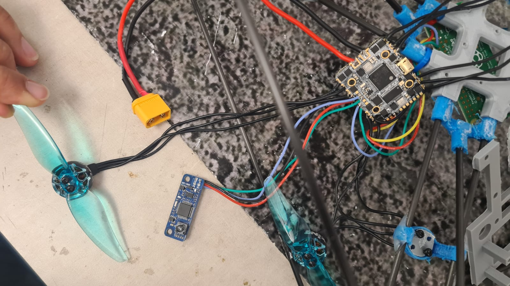

4)  Solder the optical flow. Connect the TX of the optical flow to RX2
    on the FC; the RX of the optical flow with the TX2 on the FC; the
    ground together and the 5V of the optical flow to the 4.5V of the
    FC.

5)  Solder the Raspberry Pi. Connect the 5V of the FC to the PIN2 (upper
    left connector when facing down), the ground to PIN6 (the third left
    connector), the RX6 of optical flow to PIN8 (fourth left connector)
    and TX6 of optical flow to PIN10 (fifth left connector).

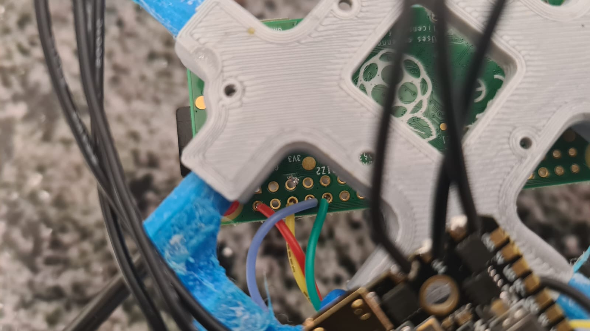


### Putting everything together

Now the electronics have to be mounted on the frame, the hardware will
then be all set for the drone.

**Step 8**

Take the built frame, the electronics, the propellers, the screws, the
rubber spacers, the PLA\_2 part.

1) Place the PLA\_2 above the screw holes of the PLA\_1 part.
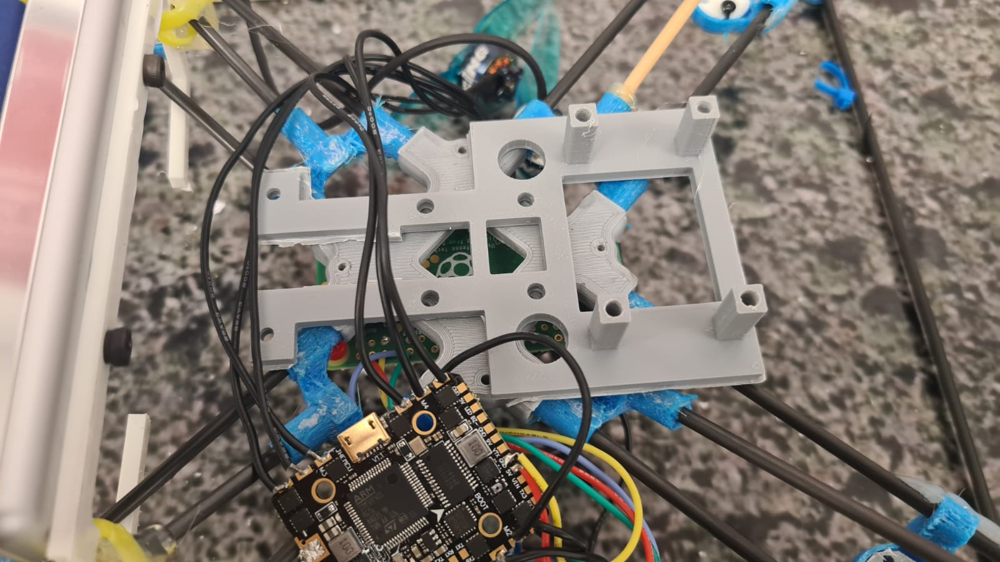

2)  Insert the 16mm screws into the four holes of the flight controller
    from bottom, then insert four rubber spacers into the screws from
    the top of the flight controller. Orient the flight controller so that the micro USB port side of the FC faces the PLA\_1 part, and that the power input of the flight controller faces the direction of the 4 pillars of the PLA\_2 part.

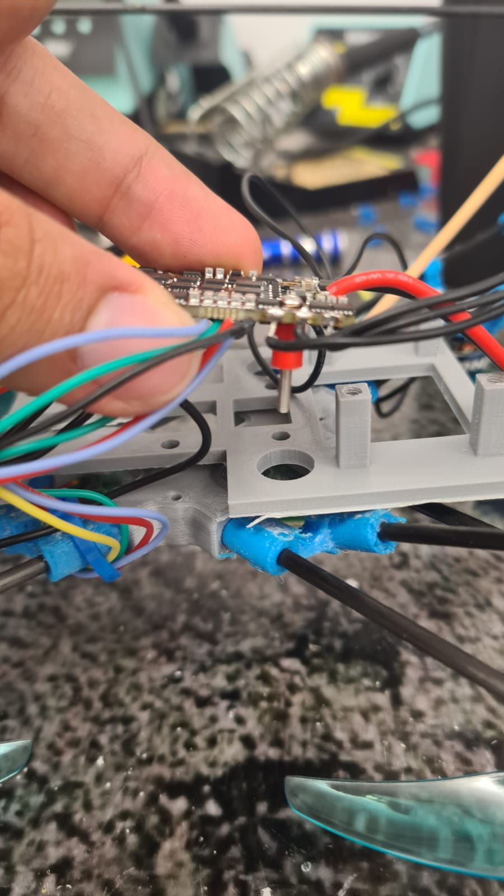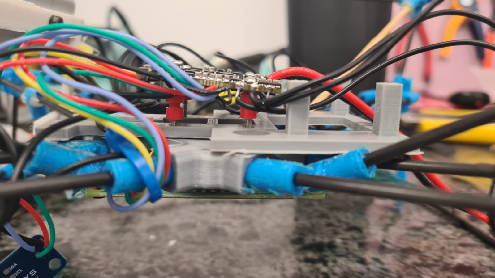

3)  Screw the 16mm screws into PLA\_1 so that the spacers begin to be
    compressed.

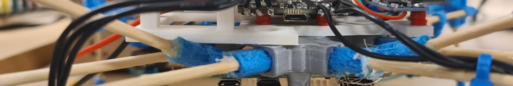

4) Put the motors at their respective place by passing them through the
    wood sticks, then screw them with the screws from the motor package into each TPU\_2 through the PLA\_8
    parts. 

    **_ATTENTION:_ Don't apply too much torque on the screws or they may go too deep, hit the coils and damage the motor! Also, double check if the screws will not touch the coils because it's easy to mix screws of different sizes.**


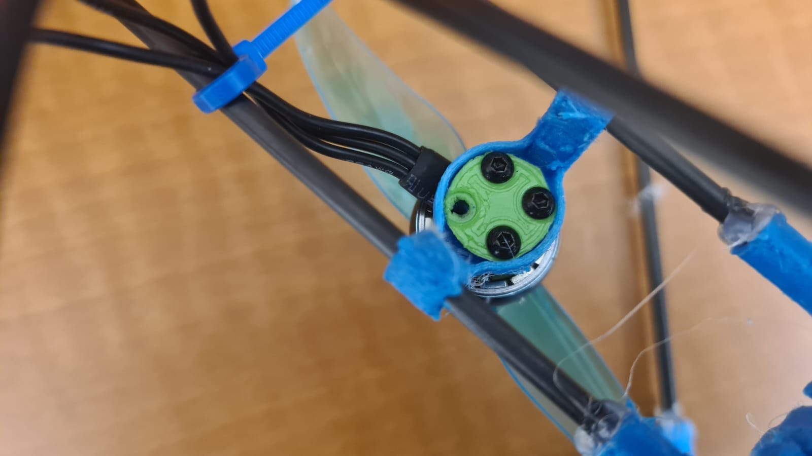


5)  Insert a 16mm screw in each PLA\_5 part, put it into the two holes
    of PLA\_1 part. Then screw them
    into the PLA\_3 part. Make sure to not stuck the small wires.
    If the screw is too lose, you can add a nut on the other side of the PLA\_1 part.

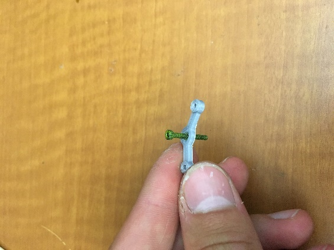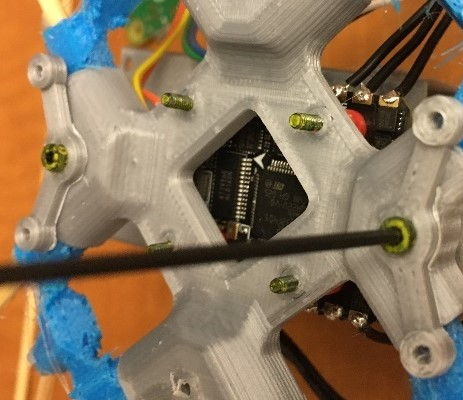


6)  Screw the optical flow into PLA\_2 part with the 16mm screws using a nut. Make sure that the optical flow is mounted in the same direction as the picture below, so that it will not be blocked later on by the T265 camera. Insert a rubber spacer between the optical
    flow and PLA\_2. Refer to the pictures below.

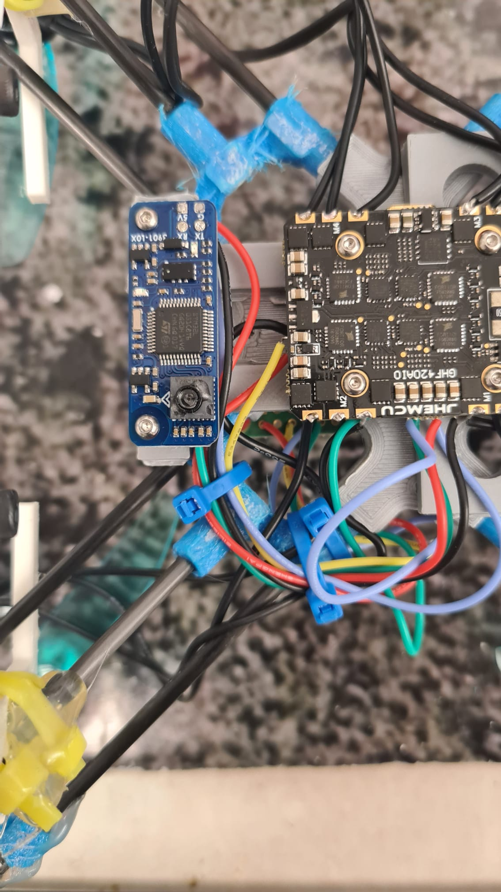 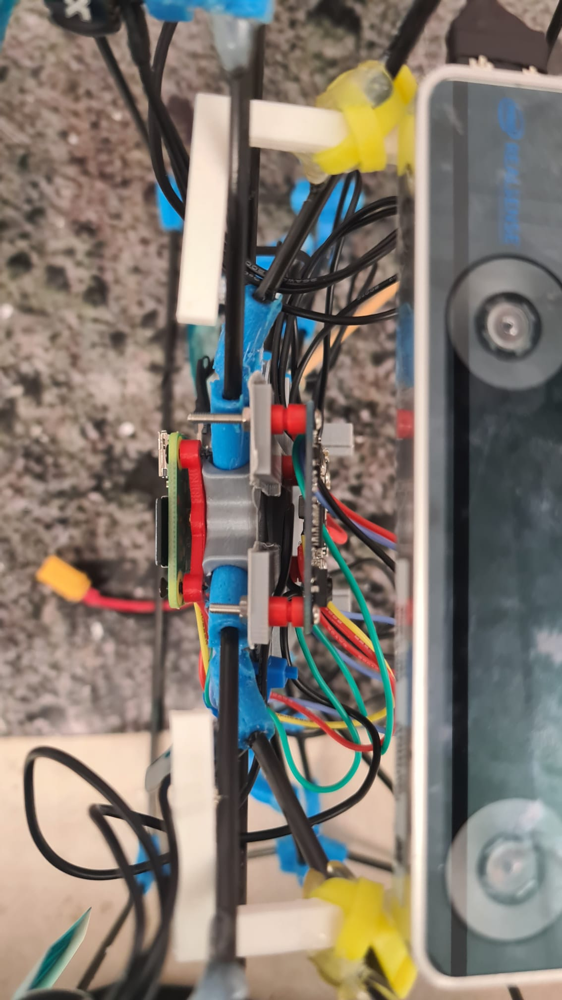


7)  Place the raspberry pi so that its camera slot faces direction of the optical flow. In case your wires are too short, you can remove the TPU\_1 joint of Raspberry Pi’s wires side from the PLA\_1. Place the PLA\_9 part's screw holes above the raspberry pi, so that the multiranger deck is above the rasbperry pi, then screw the PLA\_9 part into the PLA\_1 part through the raspberry pi.


8)  Screw the CW propellers with two 7mm screws each (from the motors
    package), at the front left and the back right of the drone, and the
    CCW propellers at the front right and the back left.


9)  Push the TPU\_2 parts across the wood sticks to make sure there is a
    gap of around 1cm between the propellers and the frame.


10) Solder the power cables to the FC.

**Step 9**

Last step to complete the assembly of the drone. Prepare the T265 camera.


1) Screw the PLA\_3 part into the PLA\_2 in the orientation shown in the picture below. Make sure that the screws going on the holes inside the frame have a head flat enough, to prevent damaging the battery.

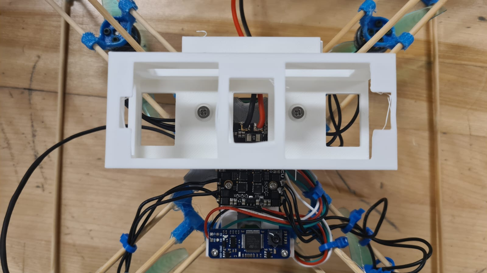

2) Screw the T265 camera on the PLA\_4 part, so that the logo upside down, on the right side.


3) Use zip tizes to attach the PLA\_4 part to the frame. Before moving on, verify that the center of gravity of the camera is about 65mm +-15mm away from the center of the FC.


4) Put hot glue inside the zip ties, between part PLA\_4 and the frame. Proceed carefully to avoid putting hot glue on the T265. If you filp the drone to put more hot glue, turn the propellers so that they are not under the glue, otherwise it can fall on them. 

5) Use zip ties wherever you have loose cables. In particular, verify that no cable is in front of the optical flow. Trim the zip ties to avoid contact with the propellers.


**Safety precaution and troubleshooting**:  
Before connecting the battery
to the drone, it is suggested to verify with a multimeter the input and
outputs power connectors of the flight controller. If a short circuit is
detected, don’t connect the battery, and verify/redo soldering. If
verification is successful, connect the battery to the drone and make sure
flight controller is lightning up. If not, disconnect the battery
immediately and touch carefully the chip of flight controller to see if
it is overheating. If it's abnormally hot, this may indicate a short circuit
with low voltage outputs, otherwise, it could be RX/TX connections.

One extra suggestion is to wear safety glasses when operating the drone 
because the motors spin at high speeds and a faulty propeller could shatter projecting 
plastic bits towards your eyes.


The hardware of the drone is now ready. Next step will be to setup the
firmware and the configuration of the fight controller with INAV and the
files on the Raspberry Pi.


## Software setup

### INAV

The configuration of the flight controller is made with INAV. It is an
open-source firmware compatible with a wide range of flight controllers.
It allows to link the different channels to the hardware connections,
and to set the different features of the drones. The firmware developed
specifically for CogniFly requires INAV version 2.3.2, software can be
downloaded on computer
[<span class="underline">here</span>](https://github.com/iNavFlight/inav-configurator/releases/tag/2.3.2).
Setup files and general instruction can be found on
[<span class="underline">GitHub</span>](https://github.com/thecognifly/cognifly-python/blob/main/readme/DRONE_SETUP.md).

**Step 1**

Open *inav-configurator.exe* from the INAV 2.3 and go to *Firmware
flasher* tab. Connect the flight controller of the drone with a
micro-USB cable to the computer.

 

**Step 2**

Click on *Load Firmware \[Local\]* and select the firmware file
*cognifly\_framework.hex* which can be downloaded
[<span class="underline">here</span>](https://github.com/thecognifly/cognifly-python/releases/download/v0.0.4/cognifly_framework.hex).
Make sure full chip erase is selected. Then, click on *Flash Firmware*,
the flight controller should turn automatically in DFU mode to flash the
firmware.


The loading bar will first erase the content of the chip then flash it.
You should see Programming successful at the end of this process.


**Step 3**

Click on the Connect blue icon on the top right INAV window. The
connection port should automatically be detected.


**Step 4**

Go to *CLI* tab (last tab on the left menu) and click on Load from file.
Select the CLI configuration file *cognifly\_configuration.txt*, which
can be downloaded
[<span class="underline">here</span>](https://github.com/thecognifly/cognifly-python/releases/download/v0.0.4/cognifly_configuration.txt).
Click Execute on the popped-up window.

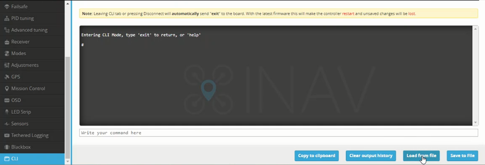


**Step 5**

After execution, type *save* in the text field and press enter, flight
controller will reboot.

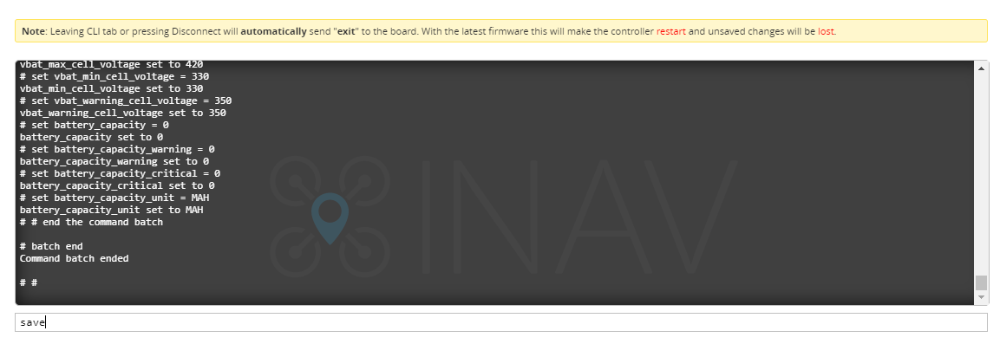

**Step 6**

If the flight controller doesn’t reconnect automatically, click on the
connect button. You should see a representation of the drone in the
*setup* tab. Go to the *Outputs* tab, where you will be able to test the
motors. Make sure that the propellers are free to move and applied
required safety measure (if you are not confident with the building
process, you may begin by removing the propellers of the motor shafts).
Connect the battery to the drone and enable motor control.


**Step 7**

For the initial motor tests, ***remove the propellers***, hold safely the drone and increase slowly the control
bar of motor 1. If abnormal behaviour occurs, put back control bar to 0
and solve the issue. If motor is vibrating without turning, this may be
a sign of disconnected or shorted wires (verify soldering of the three
wires). If motor turns as expected, verify the direction of rotation of
the motor. If the right propeller is on it, simply verify that air is
pushed under the drone. If wires connection has been made as in building
process, the motor should turn in the right direction (Refer to INAV
image to find motor directions). If the motor is turning in the wrong
direction, two of the three wires need to be inverted (it doesn’t matter
which ones) by resoldering them on the flight controller (Before
disordering, double check that the right propellers is on the motor
shaft).


**Step 8**

Redo step 7 with motors 2, 3 and 4.

**Step 9**

Verify that flow and sonar icons on the top of the window are blue. If
not, it may be a sign of a bad connection (verify soldering) or wrong
port. If ports of optical flow and Raspberry Pi have been changed from
building process (by purpose or not), the new ports can be selected in
the *Ports* tab.

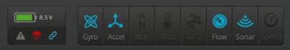


**Step 10**

Go to the *Calibration* tab and calibrate on a level surface the drone
by clicking on *Calibrate Accelerometer*. Follow INAV instructions.
After accelerometer calibration done, calibrate the optical flow by
clicking on *Calibrate Optical Flow sensor*, following INAV instruction.

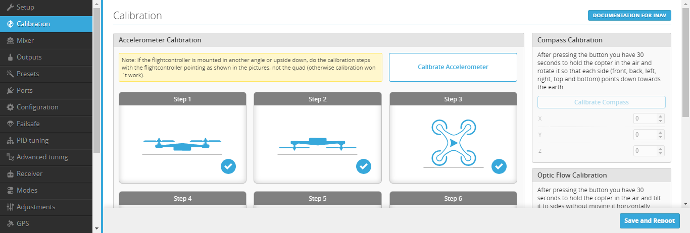 

**Step 11**

Go to *setup* tab and check the hardware health and configuration with
the pre-arming checks on the right of the window. (UAV is levelled
requires the drone to be hold horizontal).

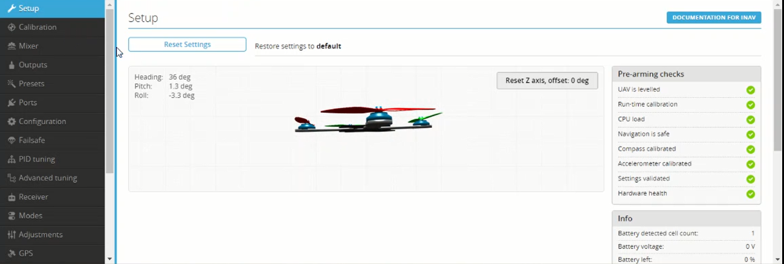

INAV configuration is now completed

### Raspberry Pi Zero 2W

The configuration of the Raspberry Pi Zero is easily made loading a disk
image on the micro-SD card. It allows to execute Python programs
controlling the drone via Wi-Fi.

**Step 12**

Download
[<span class="underline">Raspbian</span>](https://www.raspberrypi.com/software/operating-systems/)
on the SD card using *Raspberry Pi OS Lite* image. If you already have a
local disk image of a previous CogniFly, it can be used to have the Wifi
configuration set. However, the name of the new CogniFly must be
changed.

**Step 13**

A software to create disk image is required. For windows, Win32 Disk
Imager can be downloaded
[<span class="underline">here</span>](https://sourceforge.net/projects/win32diskimager/).
Insert the micro-SD card via a micro-SD to SD or micro-SD to USB adapter
so computer can access it. Open Disk imager.

Browse the image file *…-raspios-bullseye-armhf-lite.img* or your local
file *PiZeroSD.img*. Verify that the device path is pointing to the
SD-card. The process will erase the content of the SD card. Then click
on *Write* and accept erasing the SD-card.

 

After imaging process completed, two partitions should have been created
on SD card: *boot* and *rootfs*.

**Step 14**

Access the *boot* folder of the SD card and create a file without
extension named *ssh*.

***Linux system may be required to access the rootfs partition for the
following steps!***

**Step 15**

To configure the wpa-supplicant, edit
*/rootfs/etc/wpa\_supplicant/wpa\_supplicant.conf* file. (On linux, this
may require *sudo* command), adding the following (with the name of your
wifi connection) at the end of *wpa\_supplicant.conf*. Check the [troubleshooting section](readme.md#troubleshooting)
if you need extra information.

```
network={

ssid="yourNetworkSSID"

psk="yourNetworkPassword"

scan_ssid=1

}
```

**Step 16**

Change the name of the drone. Edit the */rootfs/etc/hostname* file by
replacing the default *raspberrypi* by desired drone name. Replace also
drone name in */rootfs/etc/hosts* file.

**Step 17**

Enable the multiranger and the i2C port editing the
*/boot/config.txt* file under the *\[all\]* section, set the following
lines:
```
```dtparam=i2c_arm=on,i2c_arm_baudrate=400000```
```

**Step 18**

Disable the console messages in the serial port editing the
*/boot/cmdline.txt* file. If you see *console=serial0,115200*, remove
this command. Raspberry Configuration is done.

**Step 19**

Plug the SD card into the Raspberry Pi. Plug a charged battery or
connect the Raspberry Pi with a micro-USB cable to a computer. Wait for
the Raspberry Pi to boot, the light should stop blinking.

**Step 20**

ssh the drone from your computer with the command *ssh
pi@myDroneName.local* (the default password should be raspberry). On
Windows, if ssh is not accessible from terminal,
[<span class="underline">Putty</span>](https://www.chiark.greenend.org.uk/~sgtatham/putty/latest.html)
software can be downloaded to establish the ssh connection.

**Step 21**

When Raspberry Pi successfully connected via ssh, execute the following
on the Raspberry Pi.
```
sudo apt-get update

sudo apt-get install libatlas-base-dev libopenjp2-7 libtiff5 python3-pip
```
To use the multiranger, execute the following commands:
```
sudo apt-get install -y python-smbus i2c-tools

sudo pip install smbus2 

sudo pip install vl53l1x
```


**Step 22**

Install the cognifly-python library on the drone executing the following
command.

```
pip3 install --upgrade pip

pip3 install cognifly
```

The drone should now be ready to fly, see the section Usage on
[<span class="underline">cognifly-python
repository</span>](https://github.com/thecognifly/cognifly-python#installation)
to learn how to control the drone.


## Troubleshooting
### Wifi not working
The RPI allows the user to setup the connection by the creation of a file called ```wpa_supplicant.conf``` inside the boot partition (the only partition that will show on Windows computers when you read the SD card) and it will automatically connect in the next boot.

The beginning of the file ```wpa_supplicant.conf``` will have these lines:
```
ctrl_interface=DIR=/var/run/wpa_supplicant GROUP=netdev
update_config=1
country=<Insert 2 letter ISO 3166-1 country code here>
```
You must replace ```<Insert 2 letter ISO 3166-1 country code here>``` with your country code!

Just below the lines above, you need to use one of the patterns below according to the type of wifi network available for you (and don't forget to replace the characters between ```" "``` with your own stuff):
* ssid: wifi network name between ```" "```
* psk: wifi password between ```" "```

```
# 
# 1) Visible SSID with password
#
network={
	ssid="access_point_visible_ssid"
	psk="wifi-password"
	key_mgmt=WPA-PSK
	priority=20
	id_str="Hotspot"
}

#
# 2) Hidden SSID with password
#
network={
	ssid="access_point_hidden_ssid"
	scan_ssid=1
	psk="wifi-passpord"
	key_mgmt=WPA-PSK
	priority=10
	id_str="AP_Hidden_ssid"
}

#
# 3) Access point without password
#
network={
	ssid="access_point_without_pass"
	key_mgmt=NONE
	priority=5
	id_str="AP_No_Pass"
}
```
- [List of possible problems with solutions](https://support.thepihut.com/hc/en-us/articles/360014695877-Raspberry-Pi-won-t-connect-to-WiFi)
- [Setting up a headless Raspberry Pi](https://www.raspberrypi.com/documentation/computers/configuration.html#setting-up-a-headless-raspberry-pi)
### SSH not available
It's possible to enable SSH by simply creating an empty file named ```ssh.txt``` in the boot partition (the only partition that will show on Windows computers when you read the SD card). The RPI will enable SSH next time it boots.
- [More instructions about remote access](https://www.raspberrypi.com/documentation/computers/remote-access.html)
### Flashing the FC
- Double check you are using the correct firmware version.
- Make sure you set the flight controller to DFU mode before trying to flash a new firmware.
### Some motors overheat
If some motors are hotter than the others, it is possible that they are not calibrated properly. To calibrate them, download [BLHeli](https://github.com/blheli-configurator/blheli-configurator/releases) and follow:
- Take the propellers off
- Unplug the battery
- Connect to the FC
- Open BL-heli configurator as administrator (or root)
- Go to motors, check the acknowledgement and follow the calibration instructions.

## Acknowledgements
Author of the original version of this manual: https://github.com/CharlesSol7
