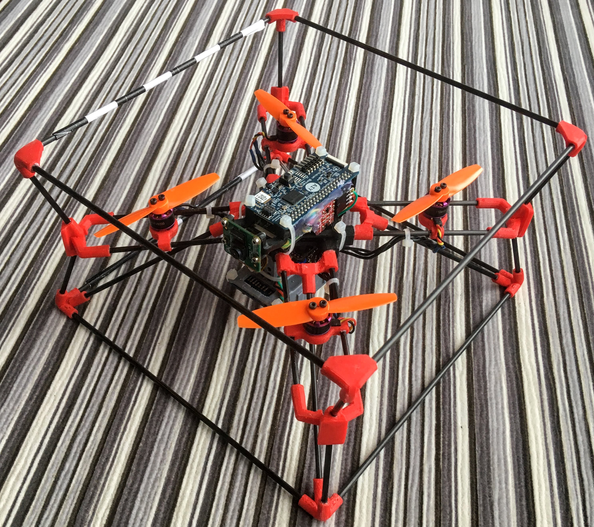
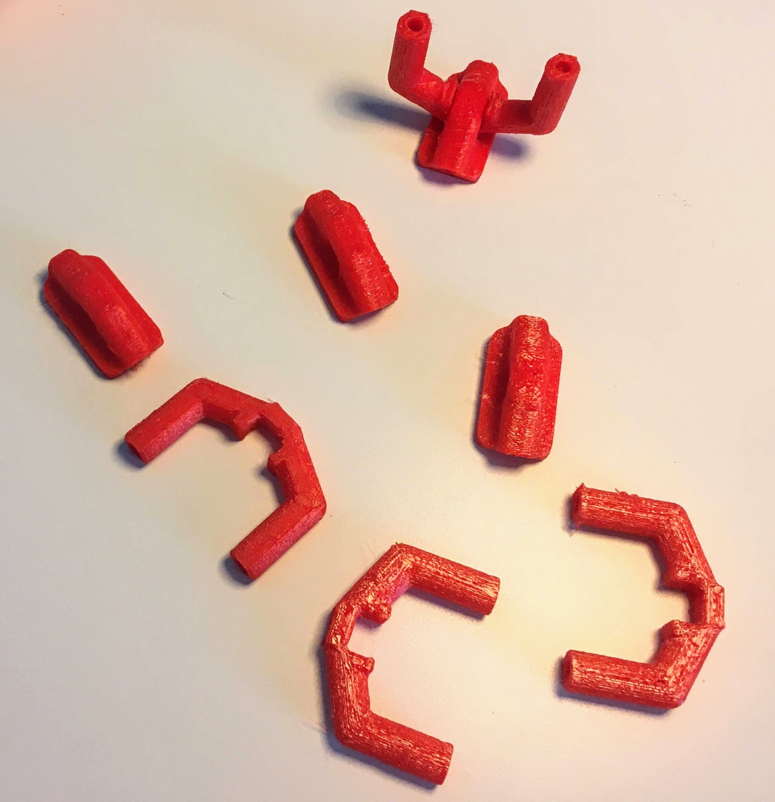
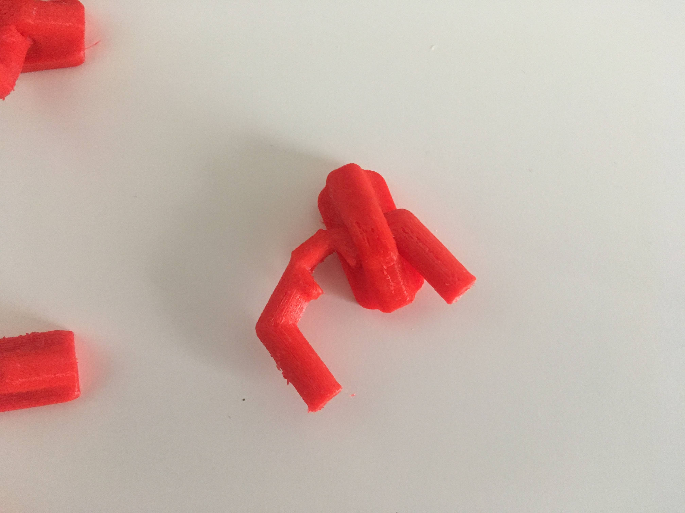
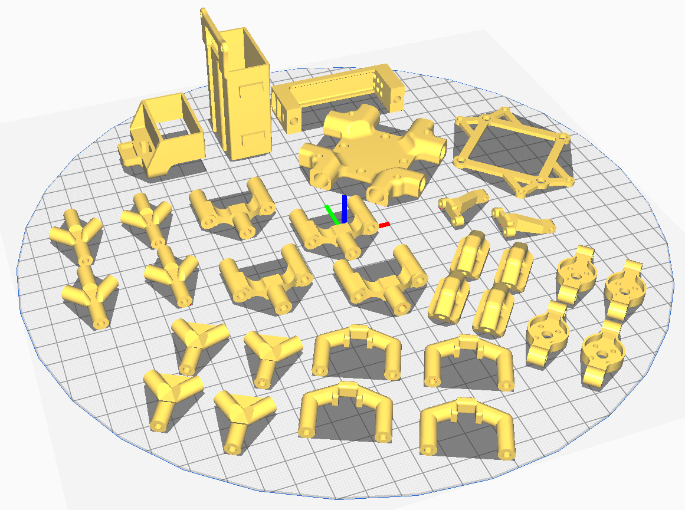
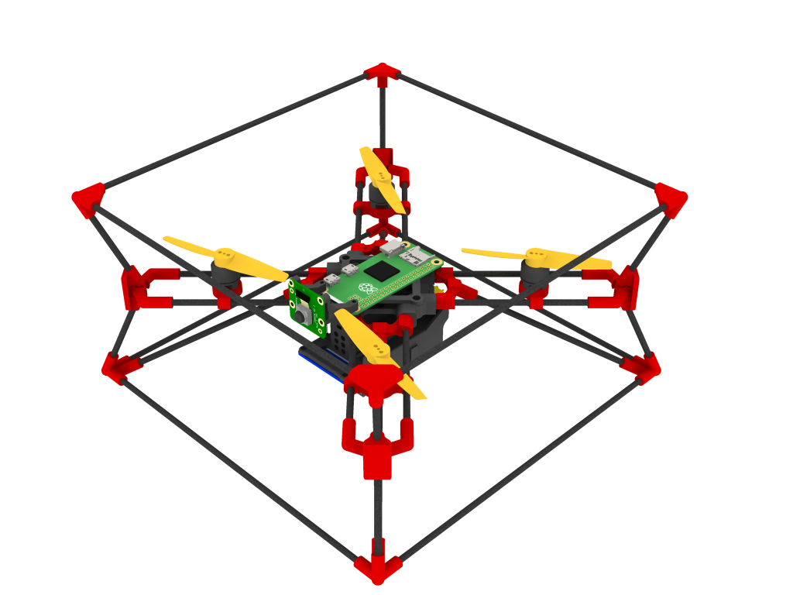
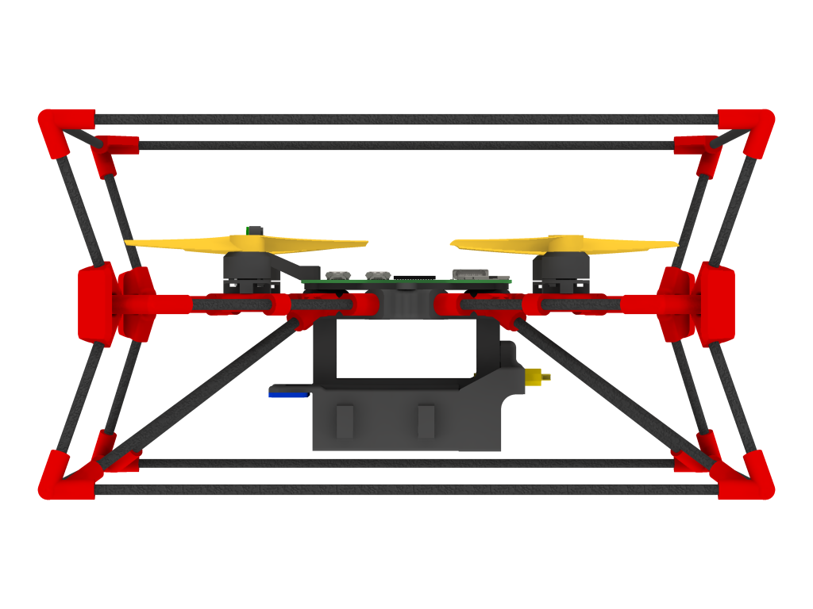

# CogniFly-STL
3D files (STL) for printing and assembling current and past versions of CogniFly

It's a very snug fit! You need to squeeze the round tube-like side, but without damaging it. Probably the hardest part to assemble.

The only part that needs support to be printed is the [Battery_holder_magnetic_lid.stl](CogniFly_v8_Crash_Tests/Battery_holder_magnetic_lid.stl). Depending on your printer, settings, fillament, etc. some holes will change the internal diameter and they may be too loose. In this case, you will need to glue the struts (carbon fiber or bamboo skewers) or, instead of absorbing the impact, the frame will just fall apart and almost no impact energy will be absorbed by the flexible parts. If you get a nice snug-fit between the struts and the TPU parts, you will not need to glue them together. In the case of bamboo, because they break much more easily than carbon fiber (never managed to break any!), if you glue them it will be annoying to replace.

All the parts in red are made of flexible TPU 95A. 

Flight controller and ESC (4-in-1) are mounted between the battery and the central part of the frame (the empty space seeing above). The central was designed with 20x20mm mounting holes. The motors shown in the photograph at the top are 1104 ones and the holes are for M2, but be careful with the length of your screws so you don't destroy the motor windings!

## Bill of Materials (BOM)
### Brushless Motors and Propellers
- (4x) 1104 6000KV (use with 3025 2 blades propeller, used in our paper)  
**or**   
- (4x) 1106 3800KV (use with 4025 2 blades propeller, and it will need a bigger frame / longer struts or the [experimental motor bases](https://github.com/thecognifly/CogniFly-STL/blob/master/CogniFly_v8_Crash_Tests/MotorBase_Shorter_Taller.stl) to avoid hitting the RPI or AIY Bonnet)
### 3D Printing Filament
- TPU 95A for flexible parts
- PLA or ABS for the rigid ones
### Struts
- 3mm diam. carbon fibre rods or BBQ bamboo skewers with these approximate lengths: 8x 195mm (external cage), 8x 97mm (arms) and 4x 72mm (legs).
### Flight Controller (20x20mm mounting holes)
- (1x) Holybro Kakute F7 Mini V2 (used in our paper) or Heli-Nation Talon F7 Fusion
### 4 in 1 ESC (20x20mm mounting holes)
- (1x) Anyone that can deliver around 15A or 20A per motor to be safe (Spedix IS35 35A used in our paper)
### Firmware
- [Our INav fork with targets: KAKUTEF7 or CLRACINGF7](https://github.com/thecognifly/inav/tree/CogniFly)
- The standard INav should also work, but you will need to check if your flight controller is supported. BetaFlight will work, but it doesn't offer position hold.
### Battery
- LiPo Battery 650mAh 11.1V 75C 3S (TATTU used in our paper)
### Single-Board Computer
- [Raspberry Pi Zero W](https://www.raspberrypi.org/products/raspberry-pi-zero-w/)
### Camera
- [Raspberry Camera V2](https://www.raspberrypi.org/products/camera-module-v2/)
### Optical Flow and Time-of-Flight sensor
- [Matek Optical Flow and Lidar sensor](http://www.mateksys.com/?portfolio=3901-l0x)
### Neural Network Accelerator
- [Google AIY Vision Kit](https://aiyprojects.withgoogle.com/vision) (the Raspberry Pi Zero W + Camera are included). You don't really need it unless you want to run some neural network models. You can try the [Google Coral Edge TPU USB](https://github.com/ricardodeazambuja/libedgetpu-rpi0/releases/tag/rpi0_tflite_edgetpu) with [an adapter](https://shop.pimoroni.com/products/usb-to-microusb-otg-converter-shim) as well.
### Extras
- (1x) XT30 connector + cable to solder it to the ESC
- Cable zip ties (approx. 2mm wide)
- M2 screws / nuts / rubber rings to mount the ESC and FC (they usually come with the FC).
- Screws for mounting the motors and propellers (check the motor's manual to avoid damaging the motor with screws that are too long!)

## Caveats
1. The connection between one of the RPI Zero UARTs ([it has two](https://www.raspberrypi.org/documentation/configuration/uart.md)) and the flight controller may suffer from external interference, so twist it, try to use the shortest length, and keep it away from other cables (specially high current ones). For the same reason, some of the unused [pins from the AIY Vision Bonnet](https://pinout.xyz/pinout/aiy_vision_bonnet) were trimmed down to avoid problems with interference.
2. If you use super glue to assemble the bamboo version, it will be very hard to remove the bamboo sticks from the flexible 3D printed parts if the bamboo breaks.
3. The way parts are placed on the 3D printer bed is very important when using FDM printers because they will dramatically change the way the part behaves (weaker in some directions, layer adhesion, etc). Therefore, try to follow the suggested directions.
4. Carbon fiber needs to be cut using water / wet tissue to avoid problems with the fine dust generated, but even like that it's a serious health hazard. If you are not sure, start with the bamboo version. **Don't forget to wear protective equipment!**
5. We suggest initially building the frame using BBQ bamboo skewers (no glue!) so you will have the perfect template for cutting the carbon fibre rods later. The frame can be made bigger or smaller up to a certain scale just by choosing the correct lengths for the struts.

## Finally, this is a collision *resilient* design, but it has its physical limits as everything else in life. It will absorb a lot of energy even in the case where it flex so much that you manage to hit the internal electronics agains the obstacle, but in this case it may damage something that is fragile. We used poly carbonate propellers and they lasted quite a few crashes before becoming too damaged for flying :)

**For more details, check [thecognifly.github.io](https://thecognifly.github.io/).**
